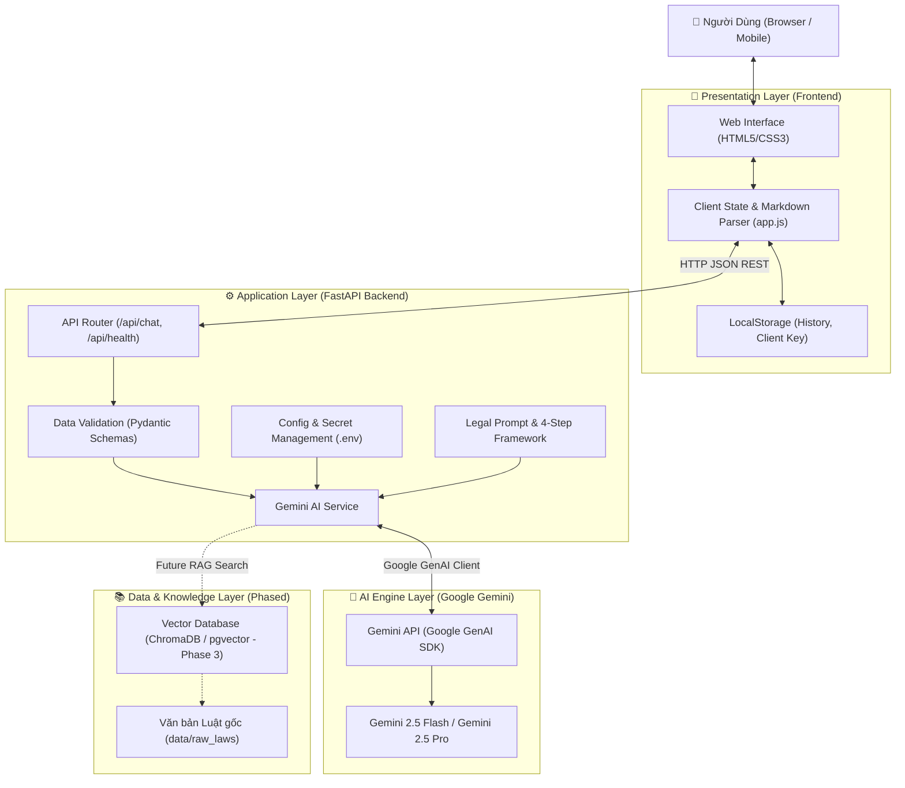

# ARCHITECTURE.md — Kiến Trúc Hệ Thống AI Lawyer (Legal AI Advisor)

Tài liệu này mô tả toàn bộ kiến trúc kỹ thuật, luồng dữ liệu, phân tầng trách nhiệm và định hướng phát triển của nền tảng **AI Lawyer**.

---

## 1. SƠ ĐỒ KIẾN TRÚC TỔNG THỂ (SYSTEM ARCHITECTURE)



---

## 2. PHÂN TẦNG TRÁCH NHIỆM (LAYERED ARCHITECTURE)

### A. Tầng Trình Diễn (Presentation Layer — `frontend/`)
* **`index.html`**: Cấu trúc giao diện ngữ nghĩa (Semantic HTML5) gồm Sidebar điều hướng, Header danh mục pháp lý, Chat Canvas cuộn mượt mà, Input composer đa dòng và Modal cấu hình API Key.
* **`css/styles.css`**: Hệ thống biến màu sắc CSS Design System theo phong cách Legal-Tech chuyên nghiệp:
  * Nền tối sang trọng: Slate Navy (`#0B0F19`, `#111827`, `#1F2937`).
  * Điểm nhấn quyền lực & pháp lý: Gold/Amber (`#D4AF37`, `#F59E0B`).
  * Hiệu ứng kính bóng mờ: Glassmorphism (`backdrop-filter: blur(12px)`).
  * Định dạng bảng biểu, code block, trích dẫn rõ ràng, dễ đọc cho người hành nghề luật.
* **`js/app.js`**:
  * Quản lý trạng thái phiên chat (Active session, session switching).
  * Render Markdown trực tiếp từ câu trả lời của AI.
  * Tự động lưu lịch sử vào LocalStorage để người dùng không bị mất nội dung khi refresh.
  * Hỗ trợ nạp API key từ giao diện hoặc dùng key cấu hình sẵn trên server.

### B. Tầng Ứng Dụng (Application Layer — `backend/`)
* **`backend/main.py`**: Điểm khởi động server FastAPI, cấu hình CORS, tích hợp StaticFiles để phục vụ frontend trực tiếp từ cùng một cổng.
* **`backend/api/routes.py`**: Định tuyến các endpoint:
  * `POST /api/chat`: Tiếp nhận tin nhắn, lịch sử chat, API key tùy chọn; gọi `gemini_service` và trả về câu trả lời.
  * `GET /api/health`: Health check, kiểm tra trạng thái hoạt động của server và cấu hình API key.
  * `GET /api/categories`: Danh sách các lĩnh vực luật hỗ trợ và gợi ý câu hỏi mẫu.
* **`backend/models/schemas.py`**: Định nghĩa cấu trúc dữ liệu nghiêm ngặt qua Pydantic: `ChatMessage`, `ChatRequest`, `ChatResponse`, `HealthResponse`.
* **`backend/core/config.py`**: Quản lý biến môi trường (`.env`), chọn model Gemini mặc định (`gemini-2.5-flash`), host/port.
* **`backend/core/legal_prompts.py`**: "Linh hồn" của AI Luật sư — định hình tư duy pháp lý, cấm bịa đặt điều luật, bắt buộc áp dụng khung tư vấn 4 bước.
* **`backend/core/gemini_service.py`**: Tích hợp Google GenAI SDK (`google-genai`), xử lý chuyển đổi lịch sử hội thoại, bắt lỗi quota/network và định dạng phản hồi chuẩn xác.

---

## 3. QUY TRÌNH TƯ VẤN 4 BƯỚC CHUẨN MỰC (4-STEP LEGAL REASONING)

Mọi phản hồi tư vấn của AI Luật sư đều được ép buộc tuân thủ quy trình 4 bước:

```text
Người dùng mô tả sự việc
           │
           ▼
[1. TÓM TẮT & NHẬN DIỆN BẢN CHẤT PHÁP LÝ]
 Xác định tư cách chủ thể, quan hệ pháp luật phát sinh (Dân sự, Lao động, Đất đai, Hợp đồng...)
           │
           ▼
[2. CĂN CỨ PHÁP LÝ ÁP DỤNG]
 Viện dẫn chính xác: Tên luật, Nghị định/Thông tư, Điều, Khoản (Không bịa đặt số liệu)
           │
           ▼
[3. PHÂN TÍCH QUYỀN, NGHĨA VỤ & ĐÁNH GIÁ RỦI RO]
 Đánh giá tính hợp pháp của các hành vi, trách nhiệm bồi thường hoặc chế tài xử phạt
           │
           ▼
[4. KHUYẾN NGHỊ HÀNH ĐỘNG & LỘ TRÌNH THỰC TẾ]
 Hướng dẫn: Thu thập chứng cứ -> Thương lượng/Khiếu nại -> Khởi kiện/Tố cáo theo luật định
```

---

## 4. BẢN ĐỒ CÂY THƯ MỤC DỰ ÁN (PROJECT DIRECTORY TREE)

```
c:\Users\Admin\Documents\ai-lawyer\
├── .agents/
│   └── rules/
│       └── legal_agent_rules.md      # Quy tắc workspace cho Antigravity IDE
├── docs/
│   ├── ARCHITECTURE.md               # Bản thiết kế kiến trúc toàn diện (file này)
│   └── LEGAL_KNOWLEDGE_BASE.md       # Cẩm nang chuẩn bị dữ liệu văn bản luật RAG
├── backend/
│   ├── api/
│   │   ├── __init__.py
│   │   └── routes.py                 # REST API endpoints (Chat, Contract, Court, RAG)
│   ├── core/
│   │   ├── __init__.py
│   │   ├── config.py                 # Cấu hình hệ thống & biến môi trường
│   │   ├── contract_parser.py        # Parser PDF, DOCX, TXT, OCR
│   │   ├── court_prompts.py          # Đối tụng ⚔️ & Thẩm phán ⚖️ Moot Court
│   │   ├── gemini_service.py         # Client giao tiếp Google GenAI SDK & RAG injection
│   │   ├── legal_prompts.py          # System Prompt & 4-Step Legal Framework
│   │   └── rag_engine.py             # Động cơ RAG tra cứu CSDL vbpl.vn
│   ├── models/
│   │   ├── __init__.py
│   │   └── schemas.py                # Pydantic Schemas (Request/Response/Citations)
│   ├── main.py                       # FastAPI entrypoint & Static Files mount
│   └── requirements.txt              # Danh sách thư viện Python
├── frontend/
│   ├── css/
│   │   └── styles.css                # Giao diện Legal-Tech Design System
│   ├── js/
│   │   └── app.js                    # Chat, Contract Review, Moot Court, RAG Badges & Modal
│   ├── assets/                       # Biểu tượng, logo
│   └── index.html                    # Giao diện Web 3-trong-1 (Chat + Review + Court + RAG)
├── data/
│   ├── legal_store/                  # CSDL Văn bản luật quốc gia chính thức (vbpl.vn)
│   │   ├── labor_code_2019.json      # BLLĐ 2019 (Điều 35, 36, 41, 125)
│   │   ├── civil_code_2015.json      # BLDS 2015 (Điều 328, 357, 418, 472)
│   │   ├── land_law_2024.json        # Luật Đất đai 2024 (Điều 45, 138)
│   │   ├── housing_law_2023.json     # Luật Nhà ở 2023 (Điều 132)
│   │   ├── commercial_law_2005.json  # Luật Thương mại 2005 (Điều 294, 300, 301)
│   │   └── civil_procedure_code_2015.json # BLTTDS 2015 (Điều 91, 95)
│   └── raw_laws/                     # Kho chứa văn bản luật dạng Text/Markdown/PDF
├── .env.example                      # File mẫu cấu hình biến môi trường
├── README.md                         # Hướng dẫn cài đặt, chạy và sử dụng nhanh
└── RULES.md                          # Bộ quy tắc quản trị, tiêu chuẩn code & đạo đức AI
```

---

## 5. LỘ TRÌNH PHÁT TRIỂN THEO GIAI ĐOẠN (ROADMAP)

* **Giai đoạn 1 (Hoàn thành):** Giao diện Chat Web trực quan + Backend FastAPI + Gemini 2.5 Flash/Pro tích hợp System Prompt Luật sư 4 bước chuẩn mực.
* **Giai đoạn 2 (Hoàn thành):** **Rà soát & Thẩm định Hợp đồng (Contract Reviewer)**: Hỗ trợ kéo thả file PDF (`pypdf`), Word (`python-docx`), TXT, Ảnh quét; phân tích Ma trận Rủi ro 5 phần & Bảng Điều khoản Bất lợi (Redline Table).
* **Giai đoạn 3A (Hoàn thành):** **Phiên Tòa Giả Lập & Đối Chất Tranh Tụng (AI Moot Court)**: Đấu trường tranh tụng đối kháng với Luật sư đối tụng (`⚔️`), Hội đồng xét xử/Thẩm phán (`⚖️`), Thước đo sức thuyết phục thời gian thực (Persuasion Meter) và Tuyên án bản án sơ thẩm.
* **Giai đoạn 3B (Hoàn thành):** **RAG & Cơ Sở Dữ Liệu Pháp Luật Quốc Gia (vbpl.vn)**: Động cơ `LegalRAGEngine` đối chiếu thời gian thực từ các bộ luật chính thống của Cổng TTĐT Chính phủ / Cơ sở dữ liệu quốc gia về văn bản pháp luật:
  * Bộ luật Lao động 2019 (Luật số 45/2019/QH14)
  * Bộ luật Dân sự 2015 (Luật số 91/2015/QH13)
  * Luật Đất đai 2024 (Luật số 31/2024/QH15 - Hiệu lực 01/08/2024)
  * Luật Nhà ở 2023 (Luật số 27/2023/QH15 - Hiệu lực 01/08/2024)
  * Luật Thương mại 2005 (Luật số 36/2005/QH11)
  * Bộ luật Tố tụng Dân sự 2015 (Luật số 92/2015/QH13)
  * Huy hiệu Trích dẫn Căn cứ Pháp lý (Click để mở Modal Tra cứu nguyên văn điều luật và đường link trực tiếp đến `vbpl.vn`).

